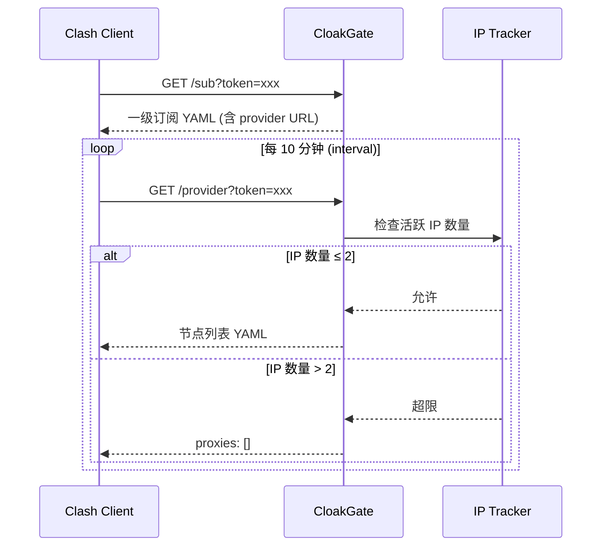

# CloakGate

<p align="center">
  
  
  
  
  
</p>

Clash 订阅分发服务，支持 **Token 验证** 和 **滑动窗口 IP 并发控制**。通过限制同一 Token 在时间窗口内的活跃 IP 数量，有效防止订阅链接被多人共享滥用。

## 功能特性

- **Token 验证** - 支持 Token 的创建、禁用、过期时间管理
- **IP 并发控制** - 滑动窗口机制统计活跃 IP，超限自动返回空节点
- **一级订阅 + Provider** - 兼容 Clash `proxy-providers` 机制
- **Admin API** - RESTful 接口管理 Token 和查看活跃 IP
- **请求日志** - 记录时间、路径、Token、IP、UA、状态码
- **Docker 部署** - 开箱即用的容器化部署方案
- **防 QQ 预览** - 二次访问验证机制，防止订阅链接被自动预览消费
- **客户端检测** - 限制仅允许 Clash 客户端访问

## 安全机制

### 防 QQ 链接预览

为防止 QQ 等聊天软件自动预览订阅链接导致 Token 绑定的 IP 次数被误消费，系统实现了二次验证机制：

1. **UA 检测**：仅响应 `User-Agent` 包含 `clash` 或 `Clash` 的请求。
2. **二次访问绑定**：
    - 首次访问 `/sub`：记录访问状态，**不绑定 IP**。
    - 后续访问 `/provider`：检查是否已访问过 `/sub`，确认后才进行 Token 与 IP 的绑定。

## 原理说明



## 快速开始

### 使用 Docker（推荐）

```bash
# 启动服务
docker-compose up -d

# 查看日志
docker-compose logs -f
```

### 本地开发

```bash
# 安装依赖
npm install

# 启动开发服务器
npm run dev

# 创建测试 Token
node scripts/create-token.js
```

## API 接口

### 订阅接口

| 端点 | 方法 | 说明 |
|------|------|------|
| `/health` | GET | 健康检查 |
| `/sub?token=xxx` | GET | 获取一级订阅 YAML (仅限 Clash 客户端) |
| `/provider?token=xxx` | GET | 获取节点列表（含 IP 控制）(仅限 Clash 客户端) |

### 管理接口

| 端点 | 方法 | 说明 |
|------|------|------|
| `/admin/token` | GET | 列出所有 Token |
| `/admin/token` | POST | 创建新 Token |
| `/admin/token/:token` | GET | 获取 Token 详情 |
| `/admin/token/:token` | PATCH | 更新 Token 状态 |
| `/admin/token/:token` | DELETE | 删除 Token |
| `/admin/token/:token/active-ips` | GET | 查看活跃 IP 列表 |

### 示例

```bash
# 健康检查
curl http://localhost:3000/health

# 获取订阅 (需指定 QA)
curl -H "User-Agent: clash" "http://localhost:3000/sub?token=YOUR_TOKEN"

# 查看 Token 列表
curl http://localhost:3000/admin/token

# 创建 Token
curl -X POST http://localhost:3000/admin/token \
  -H "Content-Type: application/json" \
  -d '{"remark": "用户A", "nodeProfile": "default"}'

# 查看活跃 IP
curl http://localhost:3000/admin/token/YOUR_TOKEN/active-ips
```

## 配置说明

编辑 `src/config/appConfig.js` 调整以下参数：

```javascript
// 服务端口
export const PORT = process.env.PORT || 3000;

// 滑动窗口时间（毫秒）
export const WINDOW_MS = 30 * 60 * 1000; // 30 分钟

// 每个 Token 最大活跃 IP 数
export const MAX_IP_PER_TOKEN = 2;

// API 域名（用于订阅模板）
export const API_DOMAIN = process.env.API_DOMAIN || 'https://api.example.com';
```

编辑 `src/config/defaultSubTemplate.yaml` 自定义订阅规则。

编辑 `src/services/yamlService.js` 中的 `generateProxiesYaml()` 配置真实节点。


## 反向代理配置

### Caddy

```
api.example.com {
    reverse_proxy localhost:3000
}
```

### Nginx

```nginx
server {
    listen 443 ssl http2;
    server_name api.example.com;

    location / {
        proxy_pass http://localhost:3000;
        proxy_set_header Host $host;
        proxy_set_header X-Real-IP $remote_addr;
        proxy_set_header X-Forwarded-For $proxy_add_x_forwarded_for;
        proxy_set_header X-Forwarded-Proto $scheme;
    }
}
```

## 依赖

| 包名 | 版本 | 说明 |
|------|------|------|
| [koa](https://koajs.com/) | ^3.1.1 | Web 框架 |
| [@koa/router](https://github.com/koajs/router) | ^15.0.0 | 路由 |
| [better-sqlite3](https://github.com/WiseLibs/better-sqlite3) | ^12.5.0 | SQLite 驱动 |
| [js-yaml](https://github.com/nodeca/js-yaml) | ^4.1.1 | YAML 解析 |

## License

[ISC](LICENSE)
