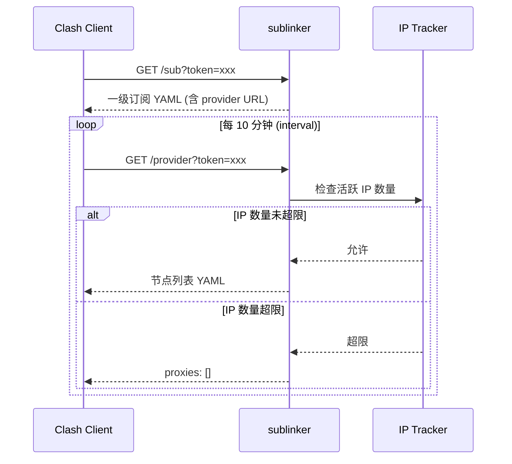

# sublinker

<p align="center">
  
  
  
  
  
</p>

Clash 订阅分发服务，支持 **Token 验证** 和 **IP 绑定并发控制**。通过限制同一订阅可绑定的 IP 数量，有效防止订阅链接被多人共享滥用。

## 功能特性

- **订阅管理** - 支持订阅创建、禁用、过期时间和节点管理
- **IP 并发控制** - 超限自动返回空节点列表
- **一级订阅 + Provider** - 兼容 Clash `proxy-providers` 机制
- **Admin API** - RESTful 接口管理订阅和查看活跃 IP
- **请求日志** - 记录时间、路径、Token、IP、UA、状态码
- **Docker 部署** - 开箱即用的容器化部署方案
- **防 QQ 预览** - User-Agent 检测机制，防止订阅链接被自动预览消费
- **客户端检测** - 支持 Clash 和 Shadowrocket 客户端访问

## 安全机制

### 防 QQ 链接预览

为防止 QQ 等聊天软件自动预览订阅链接导致 Token 绑定的 IP 次数被误消费，系统实现了 UA 检测机制：

1. **UA 检测**：仅响应 `User-Agent` 包含 `clash`、`Clash`、`shadowrocket` 或 `Shadowrocket` 的请求。
2. **IP 绑定**：
   - `/sub` 接口：返回订阅配置，**不绑定 IP**。
   - `/provider` 接口：通过 UA 和订阅校验后，**进行 IP 绑定**。

## 原理说明



## 快速开始

### 使用 Docker（推荐）

```bash
# 启动服务
docker-compose up -d

# 查看日志
docker-compose logs -f
```

### 本地开发

```bash
# 安装依赖
npm install

# 启动开发服务器
npm run dev
```

## API 接口

### 订阅接口

| 端点                  | 方法 | 说明                                                          |
| --------------------- | ---- | ------------------------------------------------------------- |
| `/health`             | GET  | 健康检查                                                      |
| `/sub?token=xxx`      | GET  | 获取一级订阅 YAML (支持 Clash 和 Shadowrocket 客户端)         |
| `/provider?token=xxx` | GET  | 获取节点列表（含 IP 控制）(支持 Clash 和 Shadowrocket 客户端) |

### 管理接口

| 端点                                      | 方法   | 说明                      |
| ----------------------------------------- | ------ | ------------------------- |
| `/admin/auth/login`                       | POST   | 管理员登录                |
| `/admin/auth/info`                        | GET    | 获取当前登录信息          |
| `/admin/subscription`                     | GET    | 列出订阅                  |
| `/admin/subscription`                     | POST   | 创建订阅                  |
| `/admin/subscription/:token`              | GET    | 获取订阅详情              |
| `/admin/subscription/:token`              | PUT    | 更新订阅                  |
| `/admin/subscription/:token`              | DELETE | 删除订阅                  |
| `/admin/subscription/:token/active-ips`   | GET    | 查看当前绑定 IP           |
| `/admin/subscription/:token/active-ips`   | DELETE | 解绑全部 IP 或解绑单个 IP |
| `/admin/subscription/:token/ip-history`   | GET    | 查看 IP 历史              |
| `/admin/subscription/:token/ip-history`   | DELETE | 清空 IP 历史              |

### 示例

```bash
# 健康检查
curl http://localhost:3000/health

# 获取订阅 (需指定 UA，支持 Clash 或 Shadowrocket)
curl -H "User-Agent: clash" "http://localhost:3000/sub?token=YOUR_TOKEN"
# 或
curl -H "User-Agent: Shadowrocket/2850" "http://localhost:3000/sub?token=YOUR_TOKEN"

# 管理员登录
curl -X POST http://localhost:3000/admin/auth/login \
  -H "Content-Type: application/json" \
  -d '{"username": "admin", "password": "your-password"}'

# 创建订阅
curl -X POST http://localhost:3000/admin/subscription \
  -H "Content-Type: application/json" \
  -H "Authorization: Bearer YOUR_TOKEN" \
  -d '{"remark":"用户A","nodeLinksText":"vless://...","maxIps":2}'

# 查看活跃 IP
curl -H "Authorization: Bearer YOUR_TOKEN" \
  http://localhost:3000/admin/subscription/SUBSCRIPTION_TOKEN/active-ips
```

## 配置说明

主要通过环境变量配置：

```javascript
// 可信代理 IP（仅这些来源可被信任为转发代理）
export const TRUSTED_PROXIES = process.env.TRUSTED_PROXIES || '127.0.0.1,::1'

// CORS 允许来源
export const CORS_ORIGIN = process.env.CORS_ORIGIN || '*'
```

编辑 `src/config/defaultSubTemplate.yaml` 自定义订阅规则。

## 反向代理配置

### Caddy（随机路径 + 前后端分离）

```caddy
panel.example.com {
    encode gzip zstd

    # 管理 API：/mEoDlubA1d4mISPXpQ/api/* -> 后端 /
    handle_path /mEoDlubA1d4mISPXpQ/api/* {
        reverse_proxy 127.0.0.1:3000
    }

    # 订阅接口可选同域转发（按需开启）
    handle /sub* {
        reverse_proxy 127.0.0.1:3000
    }
    handle /provider* {
        reverse_proxy 127.0.0.1:3000
    }

    # 前端静态资源与 SPA 回退（strip 随机前缀）
    handle_path /mEoDlubA1d4mISPXpQ/* {
        root * /var/www/sublinker-ui
        try_files {path} /index.html
        file_server
    }
}
```

## 依赖

| 包名                                                         | 版本    | 说明        |
| ------------------------------------------------------------ | ------- | ----------- |
| [koa](https://koajs.com/)                                    | ^3.1.1  | Web 框架    |
| [@koa/router](https://github.com/koajs/router)               | ^15.0.0 | 路由        |
| [better-sqlite3](https://github.com/WiseLibs/better-sqlite3) | ^12.5.0 | SQLite 驱动 |
| [js-yaml](https://github.com/nodeca/js-yaml)                 | ^4.1.1  | YAML 解析   |

## License

[ISC](LICENSE)
